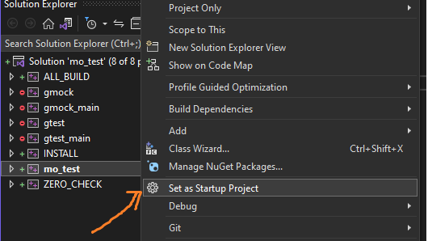

## <b> 목표 </b>
arm64 및 x86-64 아키텍쳐에서 메모리 오더링 테스트 편하게 하기위한 환경 구축

 

## <b> 추가 라이브러리 </b>
 - [준비시땅 쓰레드풀](https://github.com/yjd6808/_YJD_ready_thread.git)
 - [googletest v1.12.1](https://github.com/google/googletest)

 

## <b> 요구 사항 </b>
 - cmake 3.12 이상

 
 

## <b> 개발 시작하기 </b>

### [리눅스]  
1. git clone https://github.com/yjd6808/_YJD_mo_test mo_test && cd mo_test
2. git submodule update --init --recursive
3. cmake -S . -B build
4. cd build && make && cd ..
5. cd bin
6. ./mo_test

또는
1. git clone https://github.com/yjd6808/_YJD_mo_test mo_test && cd mo_test
2. ./build.sh
3. cd bin
4. ./mo_test

### [윈도우]  
1. git clone https://github.com/yjd6808/_YJD_mo_test mo_test
2. cd mo_test
3. git submodule update --init --recursive
4. cmake -S . -B build
5. 비주얼 스튜디오 실행
6. Open a project solution 실행

7. build/mo_test.sln 솔루션 선택
8. mo_test 프로젝트 우클릭 → Set as Startup Project 선택 후 F5 눌러서 빌드/실행하면 댐

 

참고사항 : cmake -S . -B build -DBUILD_SHARED_LIBS=ON   
씨맥 옵션을 위처럼 주게되면 동적라이브러리로 뽑아줌